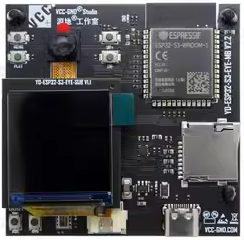
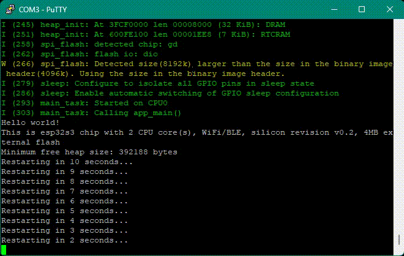
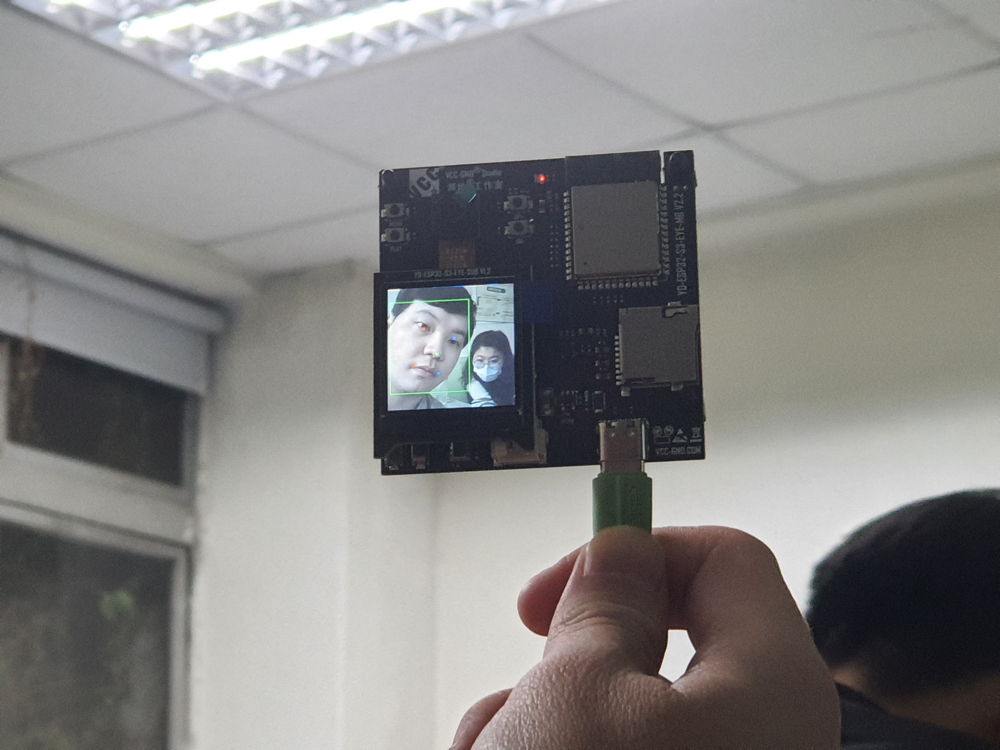
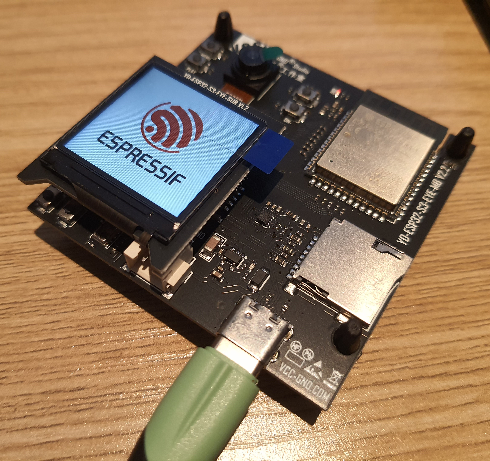
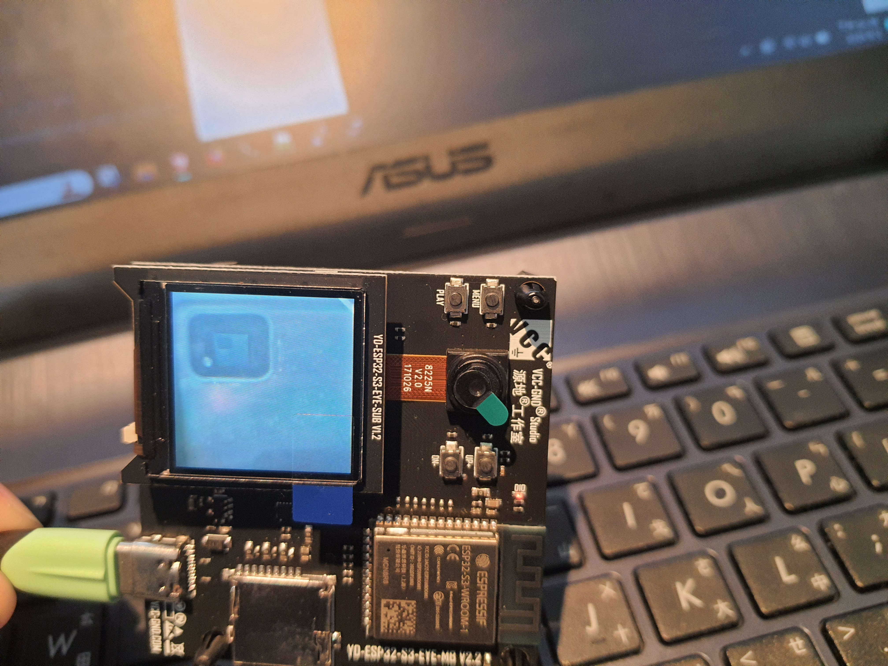

# esp

# Terminal 範例 (Hello World) 操作手冊

## Prerequisite

- ESP32 開發板：YD-ESP32-S3-EYE-MB V2.2
    
    
    
- Windows11 編譯及燒錄環境
    
    需安裝 `Espressif IDE 2.12.0 with esp idf 5.1.2`，安裝檔的[下載位置](https://dl.espressif.com/dl/esp-idf/)。
    
    安裝過程可以指定要存放的位置，這邊選擇安裝在 `D:\` 
    
    
    
    安裝過程可以選擇要安裝的 ESP 系列晶片的驅動，這邊直接選擇只為 ESP32-S 系列安裝。
    
    
    
    安裝完成後，可以看到在桌面建立的三個捷徑
    
    
    

## 本地編譯

本地編譯有以下幾個步驟：

### 1. 設定目標晶片

因為 espressif-ide-setup-2.12.0-with-esp-idf-5.1.2.exe 安裝檔就直接包含了 IDF framework，所以可以直接點選 `ESP-IDF 5.1 CMD` 進入 CMD 開發環境。

```powershell
cd examples\get-started\hello_world
```


```powershell
idf.py set-target esp32s3
```


## 2. 配置 Flash 的相關參數設定

首先需要先確認當前晶片的規格，將開發版以 USB 接上 Windows 電腦後，進入裝置管理員查看占用的 COM port。


利用 `esptool.py flash_id` **取得裝置資訊，在當前環境下，可以直接在 IDE 開發環境中使用 `python` 跟 `esptool` ，用以下命令查看

```powershell
D:\Espressif\python_env\idf5.1_py3.11_env\Scripts\python.exe ..\..\..\components\esptool_py\esptool\esptool.py --port COM3 flash_id
```


確認晶片的型號以及 flash size (可以設定的最大 SPI speed 需參考 datasheet [EPS32-S3 datasheet](https://www.espressif.com/sites/default/files/documentation/esp32-s3_datasheet_en.pdf)) 後接著使用以下命令進入 menuconfig

```powershell
idf.py menuconfig
```

進入 Serial flasher config 設定，將 flash mode 依照 ESP32-S3-EYE 的規格設定，目前開發版的設定如下：

- Flash SPI mode: DIO
- Flash Sampling Mode: STR Mode
- Flash SPI Speed: 80MHz
- Flash size: 8MB


鍵盤按 `S` 保存設定，顯示下圖後再按 `Enter`


保存成功會顯示，接著按 `Enter` 再按`Q` 就能離開 menuconfig 了


### 3. 清除舊有編譯檔

開始編譯前可以先清除舊有 build 的編譯檔，執行

```powershell
idf.py fullclean
```


### 4. 開始編譯

安裝完 IDE 之後就包含 ninja 以及 CMake 等必須指令，所以能直接進行編譯

```powershell
idf.py build
```


編譯完成後可以看到燒錄提示指令，

```powershell
Project build complete. To flash, run this command:
D:\Espressif\python_env\idf5.1_py3.11_env\Scripts\python.exe ..\..\..\components\esptool_py\esptool\esptool.py -p (PORT) -b 460800 --before default_reset --after hard_reset --chip esp32s3  write_flash --flash_mode dio --flash_size 8MB --flash_freq 80m 0x0 build\bootloader\bootloader.bin 0x8000 build\partition_table\partition-table.bin 0x10000 build\hello_world.bin
or run 'idf.py -p (PORT) flash'
```


## 燒錄與結果驗證

### 1. 清空設備程式

燒錄前可以先使用 `erase_flase` 擦除設備。

```powershell
D:\Espressif\python_env\idf5.1_py3.11_env\Scripts\python.exe ..\..\..\components\esptool_py\esptool\esptool.py --chip esp32s3 -p COM3 erase_flash
```


此時可以發現設備的 LCD 屏幕會變黑，代表擦除成功。

### 2. 開始燒錄

使用第一個提示指令透過 `esptool` 燒錄

```powershell
D:\Espressif\python_env\idf5.1_py3.11_env\Scripts\python.exe ..\..\..\components\esptool_py\esptool\esptool.py -p COM3 -b 460800 --before default_reset --after hard_reset --chip esp32s3 write_flash --flash_mode dio --flash_size 8MB --flash_freq 80m 0x0 build\bootloader\bootloader.bin 0x8000 build\partition_table\partition-table.bin 0x10000 build\hello_world.bin
```


### 3. 查看燒錄結果

確定設備連接上電腦後，開啟 Putty，設定連線 Serial Port，並使用預設 Baud Rate，


連線後就可以看到 terminal 成功在執行 hello world 範例了!



---

---

---

# LCD 範例、WEB 範例、復原範例的 Prerequisite

以下操作手冊的先決條件如下：

- 與上述環境一樣，準備開發板以及用來編譯跟燒錄的機器 (本文為 Windows11)。
- 下載 ESP-WHO，請於 CMD 中執行以下命令：
    
    ```powershell
    git clone --recursive https://github.com/espressif/esp-who.git
    cd esp-who
    git submodule update --recursive --init
    ```
    
    <aside>
    💡 請記得使用 `git submodule update --recursive --init` 拉取和更新 ESP-WHO 的所有子模塊。
    
    </aside>
    
    可以看到使用到的子模塊即為 esp-dl
    
    
    

---

---

---

# LCD 範例 (human_face_detection) 操作手冊

## 本地編譯

同上面 hello world 的範例步驟，進入 `human_face_detection\lcd` 的路徑下編譯。

## 燒錄及驗證

### 1. 清空設備程式

燒錄前可以先使用 `erase_flase` 擦除設備。

```powershell
D:\Espressif\python_env\idf5.1_py3.11_env\Scripts\python.exe ..\..\..\components\esptool_py\esptool\esptool.py --chip esp32s3 -p COM3 erase_flash
```


此時可以發現設備的 LCD 屏幕會變黑，代表擦除成功。

### 2. 開始燒錄

使用 esptool 燒錄

```powershell
# 直接切換到 esptool 路徑執行，並將編譯好的 bin 檔移到該路徑的 build/ 下
esptool.py -p COM3 -b 460800 --before default_reset --after hard_reset --chip esp32s3 write_flash --flash_mode dio --flash_size 8MB --flash_freq 80m 0x0 build\bootloader\bootloader.bin 0x8000 build\partition_table\partition-table.bin 0x10000 build\human_face_detection_lcd.bin
```


### 3. 驗證

連線到 Serial COM5 port，並將攝影機朝臉部拍攝，terminal 可以看到成功顯示 detection_result，以及偵測的位置座標。




---

---

---

# WEB 範例 (cat_face_detection) 操作手冊

## 本地編譯

同上面 hello world 的範例步驟，進入 `cat_face_detection\lcd` 的路徑下編譯。

但在配置 menuconfig 時，需要多設置 WiFi 連線資訊的步驟。

```powershell
idf.py menuconfig
```


請設定 `WiFi STA SSID` 為欲連線的 WiFi AP 的名稱，`WiFi STA Password` 為該 WiFi AP 的密碼。


## 燒錄及驗證

### 1. 清空設備程式

燒錄前可以先使用 `erase_flase` 擦除設備。

```powershell
D:\Espressif\python_env\idf5.1_py3.11_env\Scripts\python.exe ..\..\..\components\esptool_py\esptool\esptool.py --chip esp32s3 -p COM3 erase_flash
```


此時可以發現設備的 LCD 屏幕會變黑，代表擦除成功。

### 2. 開始燒錄

使用 esptool 燒錄

```powershell
# 直接切換到 esptool 路徑執行，並將編譯好的 bin 檔移到該路徑的 build/ 下
esptool.py -p COM3 -b 460800 --before default_reset --after hard_reset --chip esp32s3 write_flash --flash_mode dio --flash_size 8MB --flash_freq 80m 0x0 build\bootloader\bootloader.bin 0x8000 build\partition_table\partition-table.bin 0x10000 build\cat_face_detection_lcd.bin
```

### 3. 驗證

連線到 Serial COM5 port，可以看到 terminal 顯示如下結果，成功連線到指定的 WiFi，並取得 IP：


使用瀏覽器連線到該 IP，並準備貓的照片對準攝影機，terminal 可以看到成功顯示 detection_result，以及偵測的位置座標。


---

---

---

# 復原範例 (esp32-s3-eye) 操作手冊

## 本地編譯

本地編譯共有以下步驟：

### 1. 設定目標晶片

點選 `ESP-IDF 5.1 CMD` 進入開發環境，並切換到 esp-s3-eye 目錄下

```powershell

cd examples\esp32-s3-eye
```


### 2. 開始編譯

```powershell
idf.py build
```


編譯完成後可以看到燒錄提示指令，

```powershell
Project build complete. To flash, run this command:
D:\Espressif\python_env\idf5.1_py3.11_env\Scripts\python.exe ..\..\..\esp-idf-v5.1.2\components\esptool_py\esptool\esptool.py -p (PORT) -b 460800 --before default_reset --after hard_reset --chip esp32s3 --no-stub write_flash --flash_mode dio --flash_size 8MB --flash_freq 80m 0x0 build\bootloader\bootloader.bin 0x8000 build\partition_table\partition-table.bin 0x10000 build\esp32-s3-eye.bin 0x3f8000 build\srmodels\srmodels.bin
or run 'idf.py -p (PORT) flash'
```


## 燒錄及驗證

### 1. 清空設備程式

燒錄前先使用 `erase_flase` 擦除設備。

```powershell
D:\Espressif\python_env\idf5.1_py3.11_env\Scripts\python.exe D:\Espressif\frameworks\esp-idf-v5.1.2\components\esptool_py\esptool\esptool.py --chip esp32s3 -p COM3 erase_flash
```


### 2. 燒錄

```powershell
D:\Espressif\python_env\idf5.1_py3.11_env\Scripts\python.exe ..\..\..\esp-idf-v5.1.2\components\esptool_py\esptool\esptool.py -p COM3 -b 460800 --before default_reset --after hard_reset --chip esp32s3 --no-stub write_flash --flash_mode dio --flash_size 8MB --flash_freq 80m 0x0 build\bootloader\bootloader.bin 0x8000 build\partition_table\partition-table.bin 0x10000 build\esp32-s3-eye.bin 0x3f8000 build\srmodels\srmodels.bin
```


### 3. 驗證

燒錄成功後，就能看到 esp32-s3-eye 的程式運作了。



